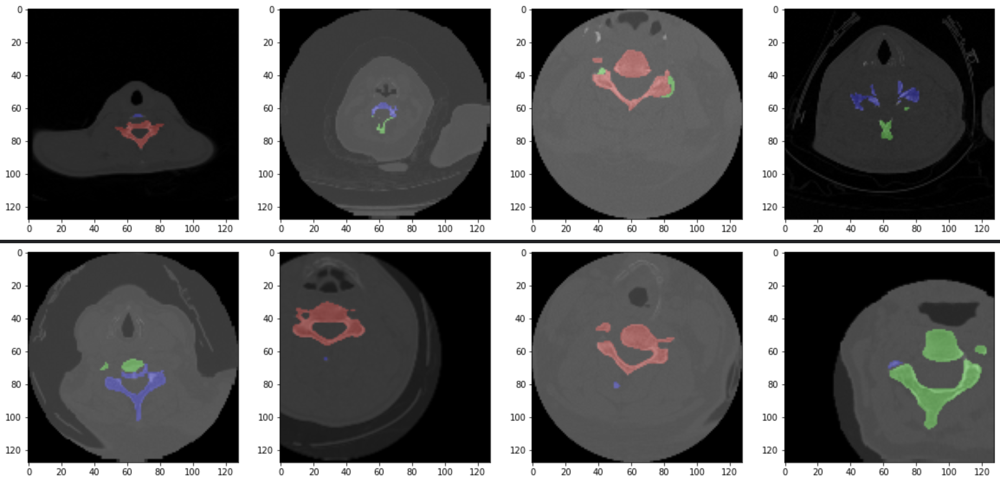
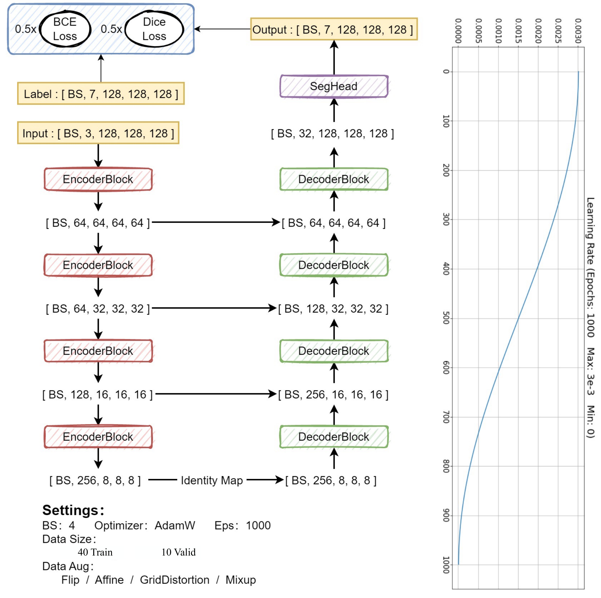
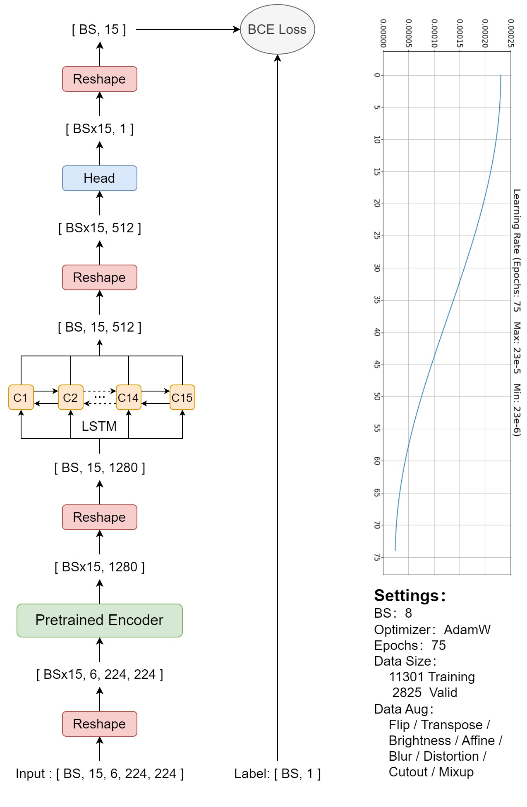
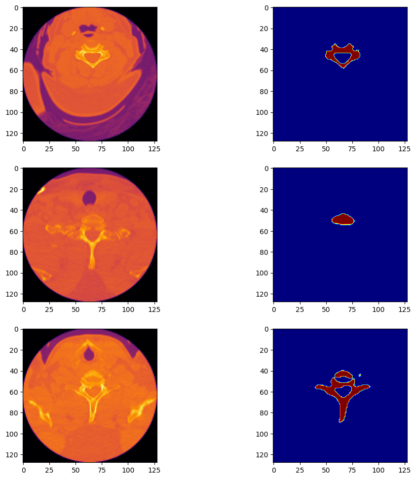
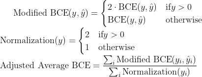

# 3D Cervical Spine Segmentation and Multi-Vertebrae Fracture Detection

The cervical spine, composed of the uppermost seven vertebrae in the spinal column, plays a pivotal role in the human skeletal system. Injuries, especially fractures to this region, can lead to severe consequences, from chronic discomfort to paralysis. With radiologists traditionally analyzing CT scans for such fractures, there exists a demand for swifter and more precise diagnostic methods. This project, "**3D Cervical Spine Segmentation and Multi Vertebrae Fracture Detection**" harnesses machine learning to offer an efficient solution. It aims to automate the fracture detection and localization process, matching the expertise of radiologists, thereby streamlining diagnosis and promoting timely medical intervention.

## Objective

To develop machine learning models that match the radiologists' performance in detecting and localizing fractures to the seven vertebrae that comprise the cervical spine and patient level.

## Data

The dataset used to developed the algorithm is from the the [RSNA 2022's Kaggle Competition](https://www.kaggle.com/competitions/rsna-2022-cervical-spine-fracture-detection/data).

There are 2019 samples of patients each having variable number of CT scans in train set and for only 87 patients the segmentation masks are given. 

Note: Unique value in the corresponding segmentation mask represent the vertebrae

## Approach

The overall approach consist of 2 stage models, first training a segmentation model to learn generating binary masks for vertebrae which we used to predict the segmentations of 7 vertebrae  for remaining 1932 patients.

**Note**: There can be more than 7 vertebrae present in image but we need only top 7 (C1 - C6)

Cropping 2k * 7 = 14k samples and for each sample there is only one single binary label.

Then for each vertebrae sample, extracting 15 slices evenly by z-dimension, and for each slice, further extracting +-2 adjacent slices to form an image with 5 channels. E.g if a 3D vertebrae sample have a shape of (128, 128, 30) then extracted 0th, 2nd, 4th, 6th….26th, 28th slices, then for example for the 2nd one, using 0th~4th slices to form a 5-channel image.

In addition, adding the predicted mask of corresponding vertebrae as the 6th channel to each image, as a way to exclude the effect of having multiple vertebraes in a single sample.

### Stage-1: Segmentation

### Stage-2: Classification

## Prediction

All pretrained model weights can be found here:

- [Segmentation Model [3D EfficientNet + Unet]](https://drive.google.com/file/d/1iNPHfXAeC66W2W30OS2LrjCjvDgmason/view?usp=sharing)
- [Classification Model [2D Convnext + LSTM]](https://drive.google.com/file/d/1G_jJocF5nVF5hIw8FwHeyd4hpvIkgqVO/view?usp=sharing)

### Stage-1

Using `Efficient ` as encoder and `Unet` as decoder, trained a 3D segmentation model to predict the corresponding masks for C1-C6 vertebraies for a  CT-scan

These masks are helpful because a CT-scan may contain other vertebrae which are not needed, so we can filter the focus area by extracting only the needed vertebrae, which can be further used to find the extent of fracture present in each vertebrae.

### Stage-2

Trained model combining `Convnext` + `LSTM` which take the input along with segmentation masks and predict the extent of fracture for each C1 - C7 vertebrae. The mean of all the vertebrae can be used for predicting the final patient, but a better approach will be to train a new model on each individual patient level.

| PatientId_vertebrae          | fractured   |
| ---------------------------- | ----------- |
| 1.2.826.0.1.3680043.22327_C1 | 0.00923574  |
| 1.2.826.0.1.3680043.22327_C2 | 0.056740694 |
| 1.2.826.0.1.3680043.22327_C3 | 0.018008368 |
| 1.2.826.0.1.3680043.22327_C4 | 0.015102041 |
| 1.2.826.0.1.3680043.22327_C5 | 0.014158976 |
| 1.2.826.0.1.3680043.22327_C6 | 0.030589141 |
| 1.2.826.0.1.3680043.22327_C7 | 0.15930048  |

### Metrics

#### Segmentation:

- **Multilabel Dice Score**: 0.92

- $$
  DSC = \frac{2 \times |A \cap B|}{|A| + |B|} \\
  $$

#### Classification:

- **Modified BCE loss:** 0.365

 	

  

## **Acknowledgement**

- [Original RSNA 2022 competition](https://www.kaggle.com/competitions/rsna-2022-cervical-spine-fracture-detection/overview)
- [Detailed explanation of data](https://www.kaggle.com/competitions/rsna-2022-cervical-spine-fracture-detection/discussion/340612)
- [Amazing 1st Place Solution (Also used 3rd model for patient level classification)](https://www.kaggle.com/c/rsna-2022-cervical-spine-fracture-detection/discussion/362787)
